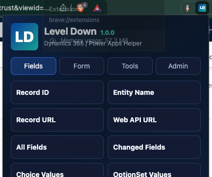
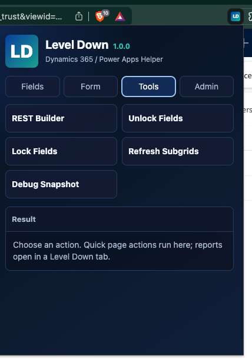
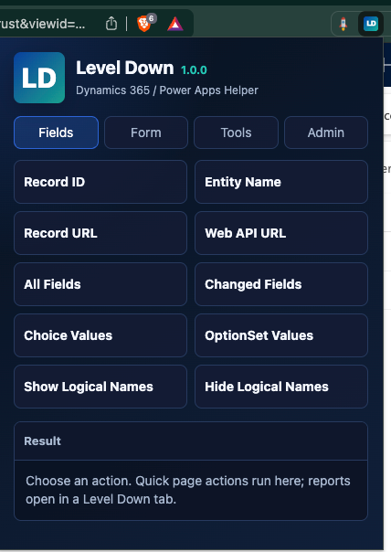
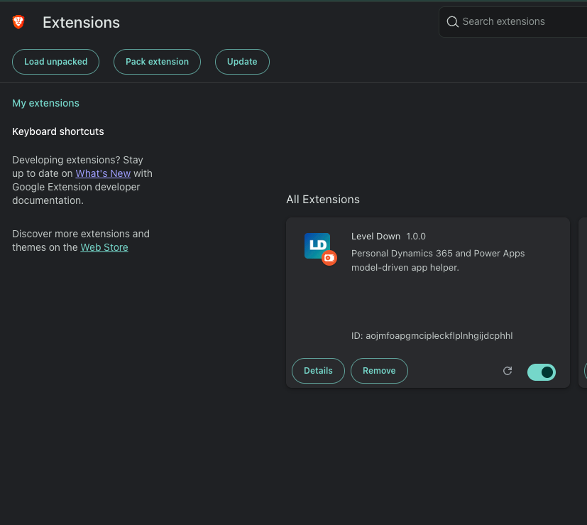

# Level Down

Chrome/Edge extension for Dynamics 365 and Power Apps model-driven apps.

Level Down helps developers and admins inspect records, fields, logical names, form details, environment info, and Dataverse Web API URLs from the current browser session.

## Use Cases

- Quickly copy record ID, table name, record URL, and Web API URL.
- View all fields or only changed fields on a form.
- Show logical names beside visible form labels.
- Copy logical names directly from the form.
- Check choices, OptionSets, tabs, sections, roles, and environment details.
- Unlock or lock fields locally while testing forms.
- Refresh subgrids during debugging.
- Build and test Dataverse Web API requests with the bundled REST Builder.

## Screenshots

### Fields

### Tools

### Fields In Dynamics

### Tools In Dynamics

## Install In Chrome

1. Download this project.
2. Open `chrome://extensions`.
3. Turn on **Developer mode**.
4. Click **Load unpacked**.
5. Select the `LevelDown` folder.
6. Done.

Open a Dynamics/Power Apps record form and click the Level Down icon.

## Install In Edge

1. Open `edge://extensions`.
2. Turn on **Developer mode**.
3. Click **Load unpacked**.
4. Select the `LevelDown` folder.

## Notes

- Works only on configured Dynamics and Power Apps hosts in `manifest.json`.
- Data stays in the browser unless you copy it or execute a REST Builder request.
- REST Builder can modify Dataverse data if you run create/update/delete requests.

## Third-Party

This project bundles Dataverse REST Builder in `DRB/`.

Dataverse REST Builder is MIT licensed by Guido Preite. Keep `DRB/LICENSE` when redistributing.

## License

Add a root `LICENSE` file before publishing as open source.
